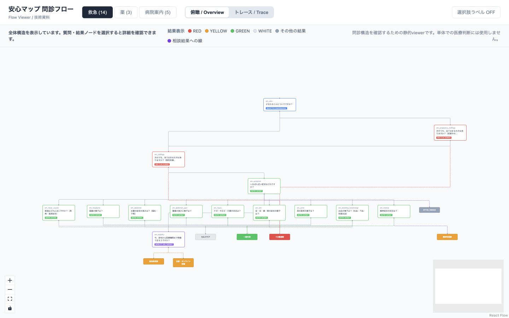

# Anshin Map Flow Viewer

安心マップの問診・分岐構造を、人間が視覚的に確認するための静的フロービューワーです。

[](https://github.com/Louis-Takeuchi/an-map-flow-viewer/actions/workflows/ci.yml)　[Live Viewer](https://an-map-flow-viewer.vercel.app/)



## このRepositoryについて

受診案内サービス「安心マップ」で設計した質問、選択肢、遷移、最終結果を、Repository内のJSONからグラフとして表示します。問診ロジックをコード内部だけに閉じず、第三者が全体構造と具体的な回答経路を確認できる状態にするための技術成果物です。

安心マップ本体、AI／自動診断システム、患者情報管理システム、医療機関推薦サービス、実運用バックエンドではありません。

## 確認できること

| 表示 | 用途 |
| --- | --- |
| Overview / 俯瞰 | 全質問、選択肢、遷移、最終結果をグラフで確認します。 |
| Trace / トレース | 回答を一つずつ選び、`question → choice → next question → … → outcome`という一つの経路を再現します。 |
| Node detail | 任意の質問・結果ノードを選び、質問文、選択肢、遷移先、トリアージ表示、`outcome_id`を確認します。 |

## 実装データ

2026年9月30日に[公開中の安心マップ](https://www.anshinmap.co.jp/)が読み込む3つの問診JSONと同期しました。質問文6件・選択肢94件の文言を更新し、補足説明・出典・結果の案内文・actionも取り込みました。分岐先、質問数、結果数に変更はありません。

数値は[`src/data/flows/`](src/data/flows/)の公開JSONから機械的に集計し、`npm run validate:flows`でも照合します。画面には公開版のプロトコルと確認日を表示します。

| フロー | 開始ノード | 質問数 | 一意な結果数 |
| --- | --- | ---: | ---: |
| 救急（`emergency`） | `em_who` | 14 | 7 |
| 薬（`medicine`） | `mf_screen` | 3 | 3 |
| 病院案内（`hospital`） | `hp_screen` | 5 | 2 |
| **合計** | — | **22** | **12** |

実装されている12の結果IDは、次の表示名に対応します。

| フロー | 結果表示 |
| --- | --- |
| 救急 | 緊急、早めの受診の目安（受診／往診等）、近日中の受診の目安、経過観察の目安、専門の相談窓口をご案内します、受診先の相談を優先 |
| 薬 | 救急の目安へ、案内へ、対面の受診先を探す |
| 病院案内 | 救急の目安へ、近くの医療機関を表示 |

RED・YELLOW・GREEN・WHITEは結果を識別するための4種類の表示設定です。色だけでなく、結果名とIDも表示します。

結果名・案内文は公開JSONの`label`・`hint`をそのまま表示します。同じ色でも、受診・往診・専門相談など結果ごとの案内を保持します。結果の色は公開JSONの`triage`に基づき、未定義時にViewerが医学的意味を補完せず`UNSPECIFIED / 未設定`として中立表示します。

## 技術構成

```text
JSON flow data
      ↓
React state and graph generation
      ↓
Dagre layout
      ↓
React Flow
      ↓
Overview / Trace / Detail
```

- React 18: UIとTrace回答履歴
- Vite 5: 開発サーバーと静的ビルド
- React Flow (`@xyflow/react`): ノード、エッジ、操作UI
- Dagre (`@dagrejs/dagre`): グラフ座標の計算
- JSON: 質問、選択肢、遷移、結果ID

詳細は[`docs/ARCHITECTURE.md`](docs/ARCHITECTURE.md)と[`docs/FLOW_DATA_FORMAT.md`](docs/FLOW_DATA_FORMAT.md)を参照してください。

## 検証できる範囲

`npm run validate:flows`は、ID重複、必須フィールド、開始ノード、参照先、到達不能な質問／結果、結果に到達しない可能性のある経路を検査します。Overview・Trace・Detailでは、その構造を人間が俯瞰・追跡できます。

この検証はデータ・グラフ構造の整合性を対象とします。医学的妥当性、診断の正しさ、実運用時の安全性、安心マップ本体の動作を検証・証明するものではありません。範囲の詳細と既知の制約は[`docs/SAFETY_AND_SCOPE.md`](docs/SAFETY_AND_SCOPE.md)に記載しています。

## Data / Privacy

アプリケーションコードはRepository内の静的JSONを読み込みます。実行時にバックエンドAPI、`fetch`、axios、WebSocket、analytics／telemetry、外部SDKを使用せず、問診回答を外部へ送信しません。

Traceの回答履歴はReactのメモリ上だけに保持されます。`localStorage`、`sessionStorage`、IndexedDB、Cookie、データベースには保存せず、再読み込みすると消えます。ホスティング事業者が通常のアクセスログを扱う可能性は、このアプリケーションコードの保証範囲外です。

## ローカルで実行

Node.js `^18.0.0 || >=20.0.0`とnpmが必要です。

```bash
git clone https://github.com/Louis-Takeuchi/an-map-flow-viewer.git
cd an-map-flow-viewer
npm ci
npm run validate:flows
npm test
npm run build
npm run dev
```

`npm run dev`が表示するローカルURLをブラウザで開きます。push／pull request時にもGitHub Actionsが`npm ci`、構造検証、テスト、buildを実行します。

## 公開版との照合・更新

```bash
npm run check:flows  # 読み取り専用。公開版と違えば終了コード1
npm run sync:flows   # 3ファイル取得・構造検証後、保存JSONと確認情報を更新
npm run validate:flows
npm test
npm run build
```

この2つの照合・更新コマンドのみネットワーク接続が必要です。Viewer自身は保存したデータを表示し、自動で公開版へ追従するものではありません。プロトコル版が同じでもJSONの内容全体を比較します。取得先、確認日時、SHA-256、件数は[`src/data/source.json`](src/data/source.json)に記録します。出典の`checked_at`は配信元が記録した日付で、Viewerの同期日とは別です。

| フロー | 確認した公開プロトコル |
| --- | --- |
| 救急 | `emergency-qsuke-v3-compat-0.3` |
| 薬 | `medicine-mvp-0.1` |
| 病院案内 | `hospital-mvp-0.3` |

## Repository構成

```text
.
├── .github/workflows/ci.yml   # 構造検証とbuildのCI
├── docs/                      # アーキテクチャ、データ形式、範囲
├── scripts/                   # 構造検証、公開版との照合・同期、テスト
├── src/
│   ├── components/            # Overview、Trace、Detail UI
│   ├── config/                # フロー開始点と表示定義
│   ├── data/flows/            # 公開サイトの問診JSON原本
│   ├── data/source.json       # 配信元・確認日時・ハッシュ
│   ├── lib/flowModel.js       # 構造検証とViewer形式への変換
│   └── hooks/                 # グラフ生成とTrace状態
└── package.json
```

AO提出時点のsnapshotは`v0.1.0`として固定しています。旧`src/data/flow_v1.0.json`は履歴参照用に残しており、現在の画面では読み込みません。
